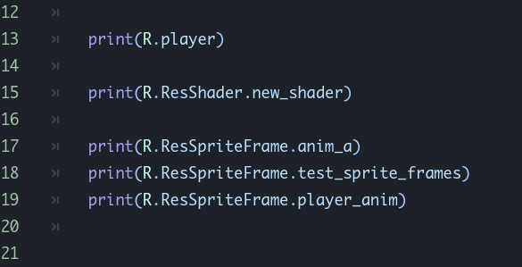

# Godot - Global Resource Name

> Godot Engine 4.4.1.stable

---

English  |  [中文](README_zh.md)

---

Automatically add the resources that configure the scanned path to the script with the class name `R`, and directly use `R.GroupName.ResourceName` to obtain the complete path of the corresponding resource without manual setting.

